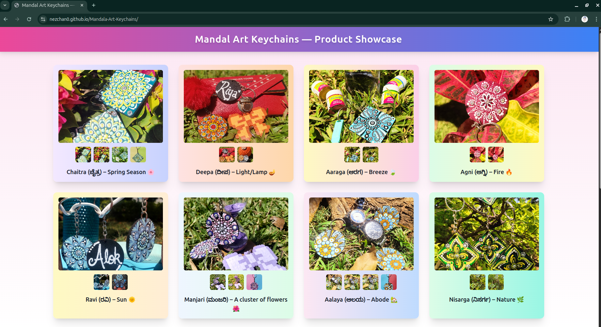

# 🪷 Mandala Art Keychains — Product Showcase

A handcrafted product showcase built with **HTML**, **Tailwind CSS**, and **Vanilla JavaScript** to beautifully present a collection of **Mandala Art Keychains**.

---

## 🌸 Project Story

This project isn’t just a webpage — it’s a creative collaboration!  

My friend designed and painted **unique Mandala art keychains** and wanted to showcase them to sell directly to friends, family, and college peers — without the hassle of listing them on e-commerce platforms.  

To help her, I built this **interactive product showcase** that highlights the beauty of each keychain. Users can:  

- Browse each keychain with smooth image transitions ✨  
- View multiple angles using a custom-built modal viewer 🔍  
- Enjoy a visually soothing gradient UI inspired by Mandala art 🎨  

We also organized a **prop photography session**, carefully styling and photographing each keychain to make them look their absolute best.  

After creating the webpage, we shared the link with friends, family, and peers — and the result was amazing: **all the keychains were sold within a week!** 💫  

---

## 🧠 Tech Stack

- **Frontend:** HTML5, TailwindCSS, Vanilla JavaScript  
- **Design:** Responsive, Mobile-Friendly Layout  
- **UI Elements:**  
  - Modal viewer with arrow & thumbnail navigation  
  - Dynamic product rendering via JavaScript  
  - Smooth fade & hover animations  

---

## 🚀 Live Demo

🔗 **Live Site:** [View on GitHub Pages](https://nezchan0.github.io/Mandala-Art-Keychains/)

---

## 📸 Preview

---

## 👤 Author

Alok Kumar Maurya – Developer | Email: [alok05.maurya@gmail.com](mailto:alok05.maurya@gmail.com)

---

## 🏷️ Topics / Tags

`HTML` `CSS` `TailwindCSS` `JavaScript` `Product Showcase` `Mandala Art` `Portfolio` `Responsive Design` `Photography` `UI/UX`
